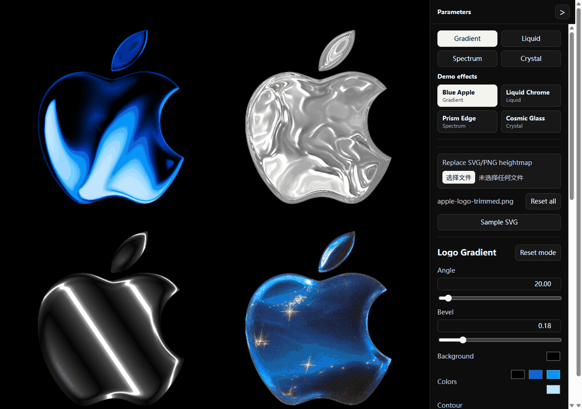

# Metal Shader Replica

React + WebGL shader playground that recreates four Framer-style material modes and lets you replace the source heightmap with SVG or PNG assets.



## Live Demo

[https://zq52xy.github.io/metal-shader-replica/](https://zq52xy.github.io/metal-shader-replica/)

## Features

- Four WebGL material modes: Gradient, Liquid, Spectrum, and Crystal.
- A reference-like 2x2 shader stage rendered with live canvases.
- Per-mode controls for color, contour, motion, depth, noise, lighting, and texture parameters.
- Demo effect presets for quickly switching between tuned material looks.
- SVG and PNG replacement through the UI.
- Collapsible parameter panel with internal scrolling.
- GitHub Pages deployment through GitHub Actions.

## Quick Start

```bash
npm install
npm run dev
```

Open:

```text
http://127.0.0.1:5173/
```

## Build And Deploy

```bash
npm run build
npm run preview
```

GitHub Pages uses the repository subpath:

```bash
npm run build:pages
npm run preview:pages
```

Deployment runs from `.github/workflows/deploy.yml` and publishes `dist/` to GitHub Pages.

## Project Structure

```text
src/
  App.tsx                 UI state, mode switching, uploads, controls
  demoPresets.ts          Demo effect metadata and uniform overrides
  FramerShaderCanvas.tsx  WebGL canvas lifecycle
  framerWebgl.ts          Shader compilation and uniform binding
  heightmap.ts            SVG/PNG rasterization and heightmap generation
  shaderPresets.ts        Mode metadata and default uniform values
  originalShaders/        Shader config modules
public/reference/
  apple-logo-trimmed.png  Default heightmap
  cosmic-bg.png           Crystal background texture
docs/
  demo.gif                Animated demo for README and GitHub preview
scripts/
  start-dev.ps1           Windows helper for starting Vite
eval/
  visual-contract.md      Quality contract
  work-contract.md        Work contract
  evidence-report.md      Validation record
```

## Open Source And Asset Notice

This repository is prepared for GitHub publishing, but public release still requires a rights review:

- `src/originalShaders/` contains shader config modules captured from the referenced Framer surface.
- `public/reference/` contains visual assets used by the local shader demo.
- The default apple-shaped PNG may involve brand or trademark considerations.

If you do not own or have permission to publish those files, replace them before making the repository public.

See `NOTICE.md` for the asset and provenance checklist.

## License

MIT, for the project code you own. Third-party or captured assets/code may require separate permission.

---

# Metal Shader Replica 中文说明

这是一个 React + WebGL shader 演示项目，用来复刻 Framer 风格的四种材质模式，并支持把源 heightmap 替换成 SVG 或 PNG。


## 在线演示

[https://zq52xy.github.io/metal-shader-replica/](https://zq52xy.github.io/metal-shader-replica/)

## 功能

- 四种 WebGL 材质模式：Gradient、Liquid、Spectrum、Crystal。
- 2x2 的实时 shader canvas 舞台，不是静态截图。
- 每个模式都暴露颜色、轮廓、运动、深度、噪声、光照、纹理等参数。
- 内置 demo effect presets，可快速切换不同材质效果。
- 支持在 UI 中替换 SVG 或 PNG 图片。
- 参数面板支持收起，并在面板内部滚动，避免控件溢出。
- 通过 GitHub Actions 自动部署到 GitHub Pages。

## 本地运行

```bash
npm install
npm run dev
```

打开：

```text
http://127.0.0.1:5173/
```

## 构建与部署

```bash
npm run build
npm run preview
```

GitHub Pages 使用仓库子路径 `/metal-shader-replica/`：

```bash
npm run build:pages
npm run preview:pages
```

部署配置在 `.github/workflows/deploy.yml`，会把 `dist/` 发布到 GitHub Pages。

## 项目结构

```text
src/
  App.tsx                 UI 状态、模式切换、上传与控件
  demoPresets.ts          Demo 效果元数据和参数覆盖
  FramerShaderCanvas.tsx  WebGL canvas 生命周期
  framerWebgl.ts          Shader 编译与 uniform 绑定
  heightmap.ts            SVG/PNG 栅格化与 heightmap 生成
  shaderPresets.ts        模式元数据与默认参数
  originalShaders/        Shader 配置模块
public/reference/
  apple-logo-trimmed.png  默认 heightmap
  cosmic-bg.png           Crystal 模式背景纹理
docs/
  demo.gif                README/GitHub 预览用动画演示
scripts/
  start-dev.ps1           Windows 本地启动脚本
eval/
  visual-contract.md      质量契约
  work-contract.md        工作契约
  evidence-report.md      验证记录
```

## 开源与素材说明

这个仓库已经按 GitHub 发布整理，但公开发布仍需要做素材和代码来源审查：

- `src/originalShaders/` 包含从参考 Framer 页面捕获的 shader 配置模块。
- `public/reference/` 包含本地 shader demo 使用的视觉素材。
- 默认苹果形 PNG 可能涉及品牌或商标注意事项。

如果你不拥有这些文件，或没有发布许可，请先替换后再公开发布。

素材与来源检查见 `NOTICE.md`。

## 许可证

你拥有的项目代码使用 MIT。第三方或捕获素材/代码可能需要单独授权。
